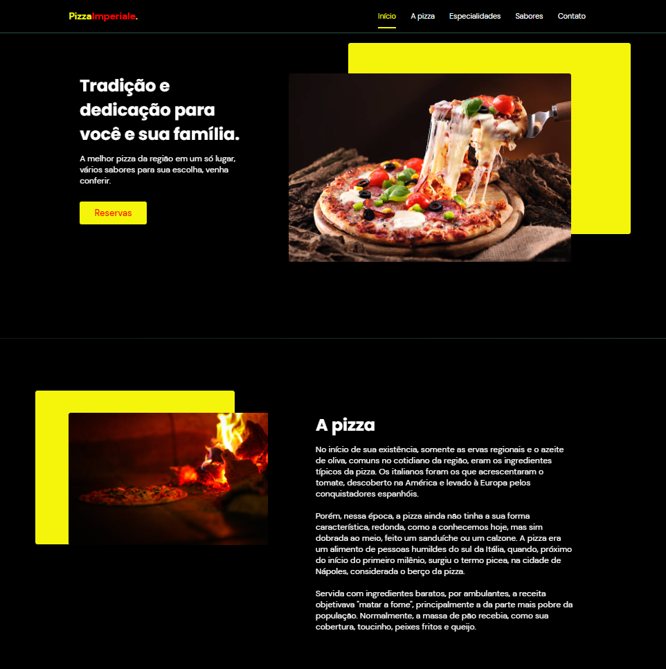
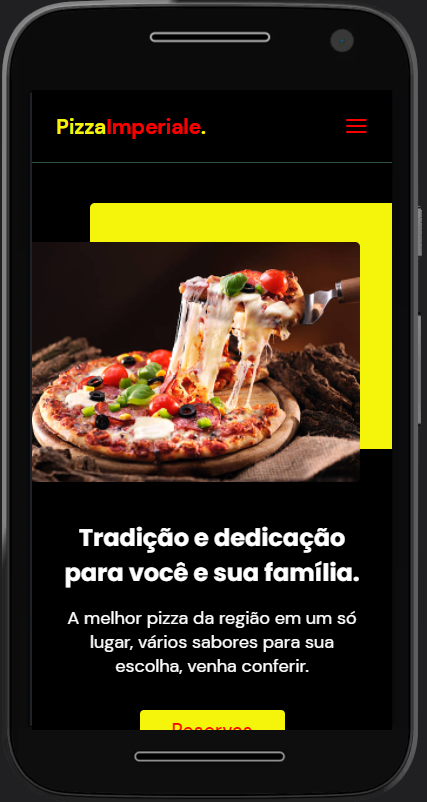

<h2 align="center">
  Pizza Imperiale
</h2>
<h3 align="center">
  Tema de web site desenvolvido para pizzarias
</h3>

 

  

  

## 💻 Projeto
Desenvolvido com o intuito de ser uma página responsiva no formato One Page e servir para a criação de outros websites. Projeto inspirado em BeuatSalon.

## :rocket: ​Tecnologias

Nsse projeto utilizo-se as tecnologias:

- HTML
- CSS
- JavaScript

Bibliotecas:

* Google Fonts
* SwipeJS
* ScrollRevel

Utilitários:

* Unsplash

## 🔖 Layout

Pizza Imperiale é um WebSite comercial com tema voltado para pizzarias.
Você pode visualizar o layout do projeto através desse link https://yan-gelsleichter.github.io/Pizza-Imperiale/
